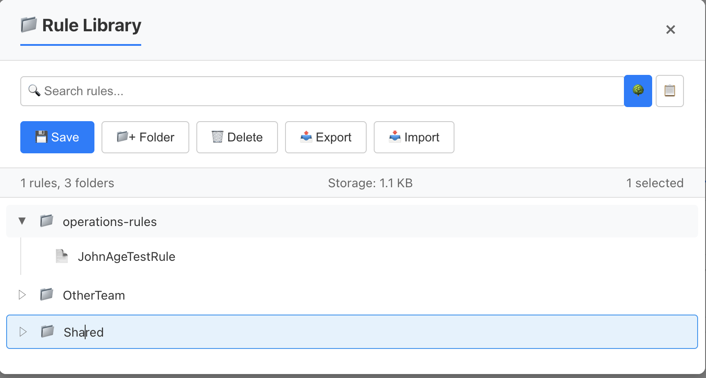

# Rule Builder

A React component for building complex rules through an intuitive visual interface.

## Component Preview


*Screenshot showing the Rule Builder component with nested rule groups, various field types, and the save/load functionality*

> **Note**: To add a screenshot, run `npm run demo` and capture the component in action. Save the image as `docs/rule-builder-preview.png`.

### Component Structure

```
┌─────────────────────────────────────────────────────────────────┐
│ Rule Builder                                    [💾 Save/Load]  │
├─────────────────────────────────────────────────────────────────┤
│ ┌─ Rule Group (AND) ─────────────────────────────────────────┐  │
│ │  ┌─ Rule ─────────────────────────────────────────────────┐ │  │
│ │  │ [Name ▼] [equals ▼] [John Doe        ] [🗑️] [📋]     │ │  │
│ │  └─────────────────────────────────────────────────────────┘ │  │
│ │                           AND                                │  │
│ │  ┌─ Rule ─────────────────────────────────────────────────┐ │  │
│ │  │ [Age  ▼] [>=     ▼] [18              ] [🗑️] [📋]     │ │  │
│ │  └─────────────────────────────────────────────────────────┘ │  │
│ │                           OR                                 │  │
│ │  ┌─ Nested Group (OR) ─────────────────────────────────────┐ │  │
│ │  │  ┌─ Rule ─────────────────────────────────────────────┐ │ │  │
│ │  │  │ [Status ▼] [equals ▼] [Active ▼] [🗑️] [📋]      │ │ │  │
│ │  │  └─────────────────────────────────────────────────────┘ │ │  │
│ │  │                        AND                              │ │  │
│ │  │  ┌─ Rule ─────────────────────────────────────────────┐ │ │  │
│ │  │  │ [Premium ▼] [is true] [        ] [🗑️] [📋]       │ │ │  │
│ │  │  └─────────────────────────────────────────────────────┘ │ │  │
│ │  │  [+ Add Rule] [+ Add Group] [🗑️ Delete Group]         │ │  │
│ │  └─────────────────────────────────────────────────────────┘ │  │
│ │  [+ Add Rule] [+ Add Group] [🗑️ Delete Group]             │  │
│ └─────────────────────────────────────────────────────────────┘  │
│                                                                 │
│ ┌─ Output Formats ─────────────────────────────────────────────┐ │
│ │ 📋 Human Readable: (Name equals "John Doe") AND (Age >= 18) │ │
│ │    AND ((Status equals "Active") AND (Premium is true))     │ │
│ │                                                             │ │
│ │ 📋 JSON: { "combinator": "and", "rules": [...] }           │ │
│ │ 📋 SQL: WHERE name = 'John Doe' AND age >= 18 AND ...      │ │
│ └─────────────────────────────────────────────────────────────┘ │
└─────────────────────────────────────────────────────────────────┘
```

### Key Features Illustrated

- **Nested Rule Groups**: Visual hierarchy with proper indentation
- **Individual Combinators**: AND/OR operators between each rule pair
- **Multiple Field Types**: Text inputs, dropdowns, number inputs, boolean toggles
- **Drag & Drop**: Reorder rules and groups with drag handles (⋮⋮)
- **Rule Actions**: Delete (🗑️) and clone (📋) buttons for each rule
- **Save/Load**: Persistent storage with folder organization
- **Real-time Output**: Multiple export formats (JSON, SQL, Human-readable)

### Save/Load Manager Interface



*Screenshot showing the Rule Library with folder organization, search functionality, and rule management*

```
┌─────────────────────────────────────────────────────────────────┐
│ 📁 Rule Library                                             [×] │
├─────────────────────────────────────────────────────────────────┤
│ [🔍 Search rules...] [🌳][📋] [💾 Save][📁+ Folder][🗑️][📤][📥] │
├─────────────────────────────────────────────────────────────────┤
│ 15 rules, 3 folders │ Storage: 2.4 KB │ 2 selected            │
├─────────────────────────────────────────────────────────────────┤
│ ┌─ Folder Tree ─────────────────────────────────────────────┐   │
│ │ 📁 ▼ Business Rules                                       │   │
│ │   📄 Customer Validation Rules                            │   │
│ │   📄 Pricing Logic                                        │   │
│ │   📁 ▼ Advanced Rules                                     │   │
│ │     📄 Multi-tier Discount Rules                         │   │
│ │     📄 Geographic Restrictions                            │   │
│ │ 📁 ▼ User Management                                      │   │
│ │   📄 Access Control Rules                                 │   │
│ │   📄 Role-based Permissions                               │   │
│ │ 📁 ▶ Archive                                              │   │
│ │ 📄 Quick Test Rule                                        │   │
│ └───────────────────────────────────────────────────────────┘   │
└─────────────────────────────────────────────────────────────────┘

┌─ Save Rule Dialog ──────────────────────────────────────────────┐
│ 💾 Save Rule                                                [×] │
├─────────────────────────────────────────────────────────────────┤
│ Name *        [Customer Age Validation                        ] │
│ Description   [Validates customer age requirements for        ] │
│               [different product categories                   ] │
│ Tags          [validation, customer, age, products            ] │
│ Folder        [📁 Business Rules                         ▼][📁+] │
│                                                                 │
│                                    [Cancel] [💾 Save Rule]     │
└─────────────────────────────────────────────────────────────────┘
```

### Save/Load Features Illustrated

- **Hierarchical Organization**: Nested folders with expand/collapse (▼/▶)
- **Search & Filter**: Real-time search across rule names, descriptions, and tags
- **View Modes**: Tree view (🌳) and List view (📋) for different browsing preferences
- **Batch Operations**: Multi-select with Ctrl/Cmd for bulk delete operations
- **Import/Export**: Full backup and restore functionality (📤/📥)
- **Quick Actions**: Save current rule (💾), create folders (📁+), delete selected (🗑️)
- **Storage Info**: Real-time display of rule count, folder count, and storage usage
- **Rule Metadata**: Shows rule complexity (rule count, group count) and last modified date

## Project Structure

```
rule-builder/
├── src/
│   ├── components/           # React components
│   │   ├── RuleBuilder/     # Main container component
│   │   ├── RuleGroup/       # Recursive group component
│   │   ├── Rule/            # Individual rule component
│   │   ├── ValueInput/      # Dynamic input component
│   │   ├── FieldSelector/   # Field selection component
│   │   └── OperatorSelector/ # Operator selection component
│   ├── types/               # TypeScript interfaces and types
│   ├── utils/               # Utility functions
│   │   ├── ruleUtils.ts     # Rule manipulation utilities
│   │   ├── validationUtils.ts # Validation utilities
│   │   └── formatUtils.ts   # Output formatting utilities
│   ├── setupTests.ts        # Test configuration
│   └── index.ts             # Main export file
├── package.json             # Dependencies and scripts
├── tsconfig.json           # TypeScript configuration
├── jest.config.js          # Jest test configuration
└── README.md               # This file
```

## Development

### Installation

```bash
npm install
```

### Testing

```bash
# Run tests once
npm test

# Run tests in watch mode
npm run test:watch

# Run tests with coverage
npm run test:coverage
```

### Building

```bash
npm run build
```

## Features

- **Visual Rule Building**: Intuitive drag-and-drop interface for creating complex rules
- **Type-Safe**: Full TypeScript support with comprehensive type definitions
- **Flexible Field Types**: Support for string, number, date, boolean, and select fields
- **Dynamic API Fields**: Fetch field options from backend APIs with caching and pagination
- **Nested Logic**: Support for nested rule groups with AND/OR combinators
- **Validation**: Real-time validation with helpful error messages
- **Save/Load Rules**: Persistent rule storage with folder organization
- **Customizable**: Extensive theming and customization options
- **Accessible**: Full keyboard navigation and screen reader support
- **Property-Based Testing**: Comprehensive testing with fast-check

## Usage

### Basic Usage

```tsx
import { RuleBuilder } from 'rule-builder';

const fields = [
  { name: 'age', label: 'Age', type: 'number' },
  { name: 'name', label: 'Name', type: 'string' },
  {
    name: 'department',
    label: 'Department',
    type: 'select',
    options: [
      { value: 'eng', label: 'Engineering' },
      { value: 'sales', label: 'Sales' }
    ]
  }
];

function App() {
  return (
    <RuleBuilder
      fields={fields}
      onChange={(rule) => console.log(rule)}
    />
  );
}
```

### API-Based Fields

Fields can fetch their options dynamically from backend APIs:

```tsx
const fieldsWithApi = [
  {
    name: 'country',
    label: 'Country',
    type: 'select',
    apiConfig: {
      endpoint: 'https://api.example.com/countries',
      valueField: 'code',
      labelField: 'name',
      cacheDuration: 300000, // 5 minutes
      headers: {
        'Authorization': 'Bearer your-token'
      }
    }
  },
  {
    name: 'users',
    label: 'User',
    type: 'select',
    apiConfig: {
      endpoint: 'https://api.example.com/users',
      valueField: 'id',
      labelField: 'displayName',
      pagination: {
        enabled: true,
        pageSize: 20,
        pageParam: 'page',
        totalField: 'total'
      }
    }
  }
];
```

### API Configuration Options

| Property | Type | Description |
|----------|------|-------------|
| `endpoint` | string | API endpoint URL |
| `method` | 'GET' \| 'POST' | HTTP method (default: 'GET') |
| `headers` | Record<string, string> | Request headers |
| `body` | any | Request body for POST requests |
| `valueField` | string | Field name for option values |
| `labelField` | string | Field name for option labels |
| `cacheDuration` | number | Cache duration in milliseconds (default: 5 minutes) |
| `pagination` | object | Pagination configuration |

### Pagination Configuration

| Property | Type | Description |
|----------|------|-------------|
| `enabled` | boolean | Enable pagination |
| `pageSize` | number | Items per page (default: 20) |
| `pageParam` | string | Page parameter name (default: 'page') |
| `totalField` | string | Total count field name (default: 'total') |

### API Response Format

The API should return data in one of these formats:

```json
// Simple array
[
  { "id": 1, "name": "Option 1" },
  { "id": 2, "name": "Option 2" }
]

// Object with data array
{
  "data": [
    { "id": 1, "name": "Option 1" }
  ],
  "total": 100
}

// Object with items array
{
  "items": [
    { "id": 1, "name": "Option 1" }
  ],
  "pagination": {
    "total": 100
  }
}
```

## Implementation Status

- ✅ Project structure and configuration
- ✅ TypeScript interfaces and types
- ✅ Testing framework setup
- ✅ Core component implementations
- ✅ State management hooks
- ✅ Validation system
- ✅ Styling and theming
- ✅ Save/Load functionality with folder organization
- ✅ Drag and drop support
- ✅ API-based field values with caching and pagination
- ✅ Comprehensive test coverage
- ✅ Demo application