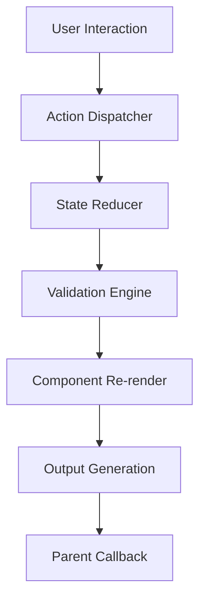

# Design Document: Rule Builder

## Overview

The Rule Builder is a React component that provides an intuitive visual interface for constructing complex conditional logic. It follows modern React patterns using functional components, hooks for state management, and a composable architecture that separates concerns between presentation and logic.

The component enables users to build rules through a drag-and-drop or form-based interface, supporting nested conditions, logical operators (AND/OR), and various field types. The design emphasizes accessibility, customization, and seamless integration with existing React applications.

## Architecture

### Component Hierarchy

```
RuleBuilder (Container)
├── RuleGroup (Recursive)
│   ├── GroupHeader
│   │   ├── CombinatorSelector (AND/OR)
│   │   └── GroupActions (Add Rule/Group, Delete)
│   └── RuleList
│       ├── Rule (Individual Condition)
│       │   ├── FieldSelector
│       │   ├── OperatorSelector  
│       │   ├── ValueInput
│       │   └── RuleActions (Delete, Clone)
│       └── RuleGroup (Nested Groups)
└── RuleOutput (JSON/String Display)
```

### State Management Architecture

The component uses a centralized state management approach with React hooks:

- **useRuleBuilder**: Main hook managing the complete rule state
- **useValidation**: Hook for real-time validation and error handling
- **useFieldConfig**: Hook for managing field definitions and operators
- **useRuleActions**: Hook providing rule manipulation methods

### Data Flow



## Components and Interfaces

### Core Interfaces

```typescript
interface RuleBuilderProps {
  fields: FieldConfig[];
  initialRule?: RuleGroup;
  onChange?: (rule: RuleGroup) => void;
  onValidationChange?: (isValid: boolean, errors: ValidationError[]) => void;
  config?: RuleBuilderConfig;
  theme?: ThemeConfig;
  className?: string;
}

interface FieldConfig {
  name: string;
  label: string;
  type: 'string' | 'number' | 'date' | 'boolean' | 'select';
  operators?: string[];
  options?: SelectOption[]; // For select fields
  validation?: FieldValidation;
  inputComponent?: React.ComponentType<ValueInputProps>;
}

interface RuleGroup {
  id: string;
  combinator: 'and' | 'or';
  rules: (Rule | RuleGroup)[];
  not?: boolean;
}

interface Rule {
  id: string;
  field: string;
  operator: string;
  value: any;
}
```

### Component Specifications

#### RuleBuilder (Main Container)
- **Purpose**: Orchestrates the entire rule building experience
- **State**: Manages the complete rule tree, validation state, and configuration
- **Props**: Accepts field configuration, initial rules, callbacks, and theming
- **Responsibilities**: 
  - Initialize and maintain rule state
  - Coordinate validation across all rules
  - Handle external API (props/callbacks)
  - Provide context to child components

#### RuleGroup (Recursive Component)
- **Purpose**: Renders a group of rules with logical combinators
- **State**: Local UI state for expand/collapse, drag operations
- **Props**: Group data, nesting level, parent callbacks
- **Responsibilities**:
  - Render combinator selector (AND/OR)
  - Manage nested rule groups
  - Handle group-level actions (add rule, add group, delete)
  - Support drag-and-drop reordering

#### Rule (Individual Condition)
- **Purpose**: Renders a single condition with field, operator, and value
- **State**: Local validation state, input focus state
- **Props**: Rule data, available fields, change callbacks
- **Responsibilities**:
  - Render field selector with type-aware operators
  - Render appropriate value input based on field type
  - Provide real-time validation feedback
  - Handle rule-level actions (delete, clone)

#### ValueInput (Dynamic Input Component)
- **Purpose**: Renders appropriate input control based on field type
- **State**: Input value, validation state
- **Props**: Field type, current value, validation rules
- **Responsibilities**:
  - Render type-specific inputs (text, number, date, select, boolean)
  - Handle input validation and formatting
  - Support custom input components
  - Provide accessibility features

## Data Models

### Rule State Structure

The rule state follows a tree structure that mirrors the logical organization:

```typescript
// Example rule state
const exampleRule: RuleGroup = {
  id: "root",
  combinator: "and",
  rules: [
    {
      id: "rule-1",
      field: "age",
      operator: ">=",
      value: 18
    },
    {
      id: "group-1", 
      combinator: "or",
      rules: [
        {
          id: "rule-2",
          field: "status",
          operator: "equals",
          value: "active"
        },
        {
          id: "rule-3",
          field: "premium",
          operator: "equals", 
          value: true
        }
      ]
    }
  ]
}
```

### Field Type System

Each field type has associated operators and validation rules:

```typescript
const fieldTypeConfig = {
  string: {
    operators: ['equals', 'notEquals', 'contains', 'startsWith', 'endsWith', 'isEmpty'],
    inputType: 'text',
    validation: (value) => typeof value === 'string'
  },
  number: {
    operators: ['equals', 'notEquals', '>', '>=', '<', '<=', 'between'],
    inputType: 'number',
    validation: (value) => !isNaN(Number(value))
  },
  date: {
    operators: ['equals', 'notEquals', 'before', 'after', 'between'],
    inputType: 'date',
    validation: (value) => !isNaN(Date.parse(value))
  },
  boolean: {
    operators: ['equals', 'isTrue', 'isFalse'],
    inputType: 'checkbox',
    validation: (value) => typeof value === 'boolean'
  }
};
```

### Output Formats

The component supports multiple output formats:

```typescript
interface RuleOutput {
  json: RuleGroup;           // Native format
  sql: string;              // SQL WHERE clause
  mongodb: object;          // MongoDB query
  readable: string;         // Human-readable format
  custom?: any;             // Custom formatter result
}
```

## Correctness Properties

*A property is a characteristic or behavior that should hold true across all valid executions of a system—essentially, a formal statement about what the system should do. Properties serve as the bridge between human-readable specifications and machine-verifiable correctness guarantees.*

Now I need to analyze the acceptance criteria to determine which ones can be tested as properties:

Based on the prework analysis, I'll consolidate related properties to avoid redundancy:

### Property 1: Rule Construction and Display
*For any* valid rule structure, the Rule Builder should display it in both structured JSON format and human-readable string format.
**Validates: Requirements 1.5, 4.1, 4.2**

### Property 2: Field Type Operator Mapping  
*For any* field type (string, number, date, boolean), when selected, the Rule Builder should display only the operators appropriate for that field type.
**Validates: Requirements 2.2, 2.3, 2.4, 2.5, 2.6**

### Property 3: Rule State Management
*For any* rule modification (add, edit, delete), the Rule Builder should trigger the onChange callback with the correctly updated rule structure.
**Validates: Requirements 4.4**

### Property 4: Validation and Error Handling
*For any* invalid or incomplete rule state, the Rule Builder should display appropriate validation errors and prevent saving until resolved.
**Validates: Requirements 3.1, 3.2, 3.4, 3.5**

### Property 5: Rule Structure Integrity
*For any* rule operations (grouping, nesting, combining with operators), the resulting rule structure should maintain logical consistency and proper hierarchy.
**Validates: Requirements 1.3, 1.4, 3.3**

### Property 6: Configuration Acceptance
*For any* valid field configuration, initial rule object, or theme configuration provided to the Rule Builder, it should accept and apply the configuration correctly.
**Validates: Requirements 2.1, 4.3, 6.2**

### Property 7: Interactive Functionality
*For any* user interaction (add condition, delete rule, undo/redo), the Rule Builder should respond appropriately and maintain consistent state.
**Validates: Requirements 1.2, 5.5, 5.6**

### Property 8: Export Format Consistency
*For any* completed rule, the Rule Builder should be able to export it in all supported formats (JSON, SQL, custom) without data loss.
**Validates: Requirements 4.5**

### Property 9: Accessibility Compliance
*For any* interactive element in the Rule Builder, it should be keyboard navigable and have appropriate ARIA labels for screen readers.
**Validates: Requirements 5.1, 5.2, 5.3**

### Property 10: Customization Support
*For any* custom CSS classes, validation functions, or component renderers provided, the Rule Builder should apply them correctly without breaking core functionality.
**Validates: Requirements 6.1, 6.3, 6.4, 6.5**

## Error Handling

### Validation Strategy

The Rule Builder implements a multi-layered validation approach:

1. **Real-time Field Validation**: Validates individual field values as users type
2. **Rule Completeness Validation**: Ensures all required fields are filled
3. **Logical Consistency Validation**: Checks for contradictory or impossible conditions
4. **Schema Validation**: Validates the overall rule structure against the expected format

### Error Types and Handling

```typescript
interface ValidationError {
  id: string;
  type: 'field' | 'rule' | 'group' | 'schema';
  severity: 'error' | 'warning' | 'info';
  message: string;
  path: string[]; // Path to the problematic element
  suggestions?: string[];
}
```

**Field-level Errors**:
- Invalid data type (e.g., text in number field)
- Missing required values
- Values outside acceptable ranges

**Rule-level Errors**:
- Incomplete conditions (missing field, operator, or value)
- Logically impossible conditions (e.g., age > 100 AND age < 0)

**Group-level Errors**:
- Empty rule groups
- Contradictory conditions within the same group

**Schema-level Errors**:
- Malformed rule structure
- Invalid field references
- Unsupported operators

### Error Recovery

The component provides several error recovery mechanisms:

1. **Auto-correction**: Automatically fixes common issues (e.g., trimming whitespace)
2. **Suggestions**: Provides actionable suggestions for resolving errors
3. **Graceful Degradation**: Continues to function with partial data when possible
4. **Reset Options**: Allows users to reset to last valid state

## Testing Strategy

### Dual Testing Approach

The Rule Builder will be tested using both unit tests and property-based tests to ensure comprehensive coverage:

**Unit Tests** focus on:
- Specific component rendering scenarios
- User interaction flows (click, type, drag)
- Edge cases and error conditions
- Integration between components
- Accessibility compliance verification

**Property-Based Tests** focus on:
- Universal properties that hold across all rule configurations
- Validation behavior across all possible input combinations
- State consistency across all user operations
- Output format correctness for all rule structures

### Property-Based Testing Configuration

- **Testing Library**: We'll use `@fast-check/jest` for property-based testing in React
- **Test Iterations**: Minimum 100 iterations per property test
- **Test Tagging**: Each property test will reference its design document property

Example property test structure:
```typescript
// Feature: rule-builder, Property 1: Rule Construction and Display
test('Rule construction and display property', () => {
  fc.assert(fc.property(
    ruleStructureArbitrary,
    (rule) => {
      const { getByTestId } = render(<RuleBuilder initialRule={rule} />);
      const jsonOutput = getByTestId('json-output');
      const readableOutput = getByTestId('readable-output');
      
      expect(jsonOutput).toHaveTextContent(JSON.stringify(rule));
      expect(readableOutput).toHaveTextContent(expect.any(String));
      expect(readableOutput.textContent.length).toBeGreaterThan(0);
    }
  ));
});
```

### Test Data Generation

Property tests will use smart generators that create realistic rule structures:

```typescript
const fieldArbitrary = fc.record({
  name: fc.string(),
  type: fc.constantFrom('string', 'number', 'date', 'boolean'),
  label: fc.string()
});

const ruleArbitrary = fc.record({
  id: fc.uuid(),
  field: fc.string(),
  operator: fc.string(),
  value: fc.anything()
});

const ruleGroupArbitrary = fc.letrec(tie => ({
  ruleGroup: fc.record({
    id: fc.uuid(),
    combinator: fc.constantFrom('and', 'or'),
    rules: fc.array(fc.oneof(
      tie('ruleGroup'),
      ruleArbitrary
    ), { minLength: 1, maxLength: 5 })
  })
}));
```

### Integration Testing

Integration tests will verify:
- Component interaction with parent applications
- Callback function execution with correct parameters
- Theme and configuration application
- Export functionality with external systems

### Performance Testing

Performance tests will ensure:
- Responsive rendering with large rule sets (>100 rules)
- Efficient re-rendering on state changes
- Memory usage within acceptable bounds
- Smooth animations and transitions

The testing strategy ensures that the Rule Builder maintains correctness, performance, and usability across all supported use cases and configurations.